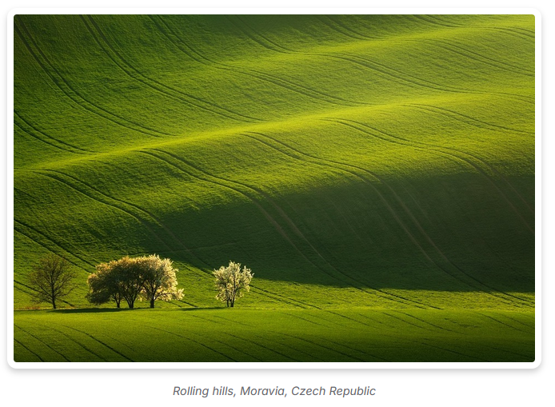
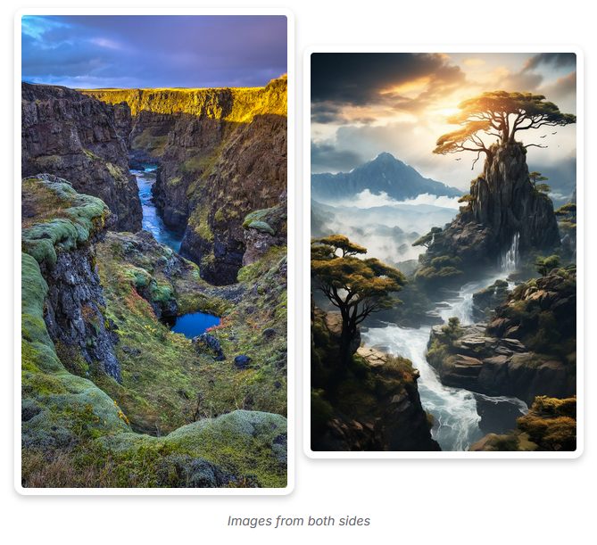
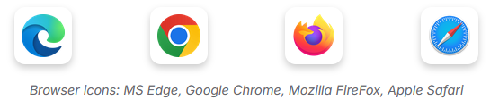
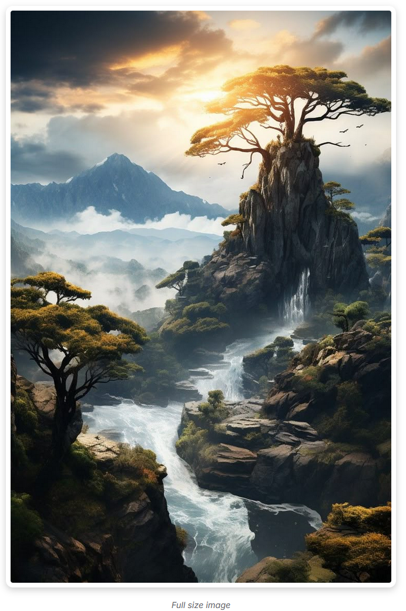
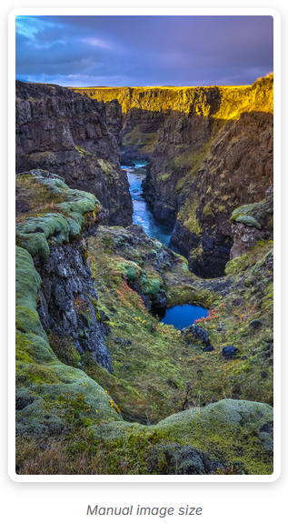

# miletorix-vitepress-image-group

Vue 3 component to render responsive image groups with automatic layout styling (big, double or icon).

  

<p align="center">
  
</p>

## Live Demo and more information

✨ See it in action:  
👉 [https://miletorix.github.io/miletorix-vitepress-image-group/](https://miletorix.github.io/miletorix-vitepress-image-group/)

📦 NPM Package:  
👉 [https://www.npmjs.com/package/@miletorix/vitepress-image-group](https://www.npmjs.com/package/@miletorix/vitepress-image-group)

## Limitations

- No lazy loading customization (yet).
- Only accepts array of strings as `sources`.

## Installation

```sh
npm i @miletorix/vitepress-image-group
```

## Usage

### Configuration

```typescript
// docs/.vitepress/theme/index.ts
import type { Theme } from 'vitepress'
import DefaultTheme from 'vitepress/theme'
 
import { ImageGroup } from '@miletorix/vitepress-image-group' // [!code ++]
import '@miletorix/vitepress-image-group/style.css' // [!code ++]

export default {
  extends: DefaultTheme,
  enhanceApp(ctx) {
    ctx.app.component('ImageGroup', ImageGroup) // [!code ++]
  }
}
```

### Image Group

```vue
<ImageGroup
  :sources="[
    'path-to-image...'
  ]"
  type="type..."
  alt="alt text..."
  caption="caption text..."
/>
```

> [!IMPORTANT]
> Type required: `'icon' | 'big' | 'double' | 'auto' | 'manual'`

> [!NOTE]
> **Alt** and **caption** text is optional, default alt text is **ImageGroup - type**

> [!NOTE]
> 5 types of image grouping are supported:
> - `big` (800px wide single image)
> - `double` (two images side by side)
> - `icon` (small 70×70px images in a row)
> - `auto` (full size image)
> - `manual` (manual width and automatic height)

## Examples

### Image Group - `big`

**Input:**

```vue
<ImageGroup
  :sources="[
    'demo-2.jpg'
  ]"
  type="big"
  caption="Rolling hills, Moravia, Czech Republic"
/>
```

**Output:**

 

### Image Group - `double`

**Input:**

```vue [example.md]
<ImageGroup
  :sources="[
    '/img/demo-3.jpg',
    '/img/demo-4.jpg'
  ]"
  type="double"
  caption="Images from both sides"
/>
```

**Output:**

 

### Image Group - `icon`

**Input:**

```vue
<ImageGroup
  :sources="[
    '/img/edge-logo.png',
    '/img/chrome-logo.png',
    '/img/firefox-logo.png',
    '/img/safari-logo.png'
  ]"
  type="icon"
  caption="Browser icons: MS Edge, Google Chrome, Mozilla FireFox, Apple Safari"
/>
```

**Output:**

 

### Image Group - auto

**Input:**
```vue
<ImageGroup
  :sources="[
    'demo-4.jpg'
  ]"
  type="auto"
  caption="Full size image"
/>
```

**Output:**

 

### Image Group - manual

**Input:**
```vue
<ImageGroup
  :sources="[
    'demo-3.jpg'
  ]"
  type="manual"
  width="300px"
  caption="Manual image size"
/>
```

**Output:**

